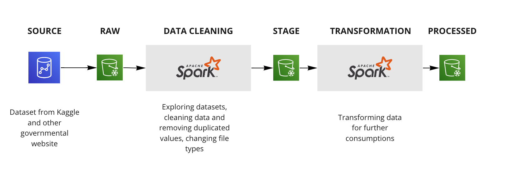
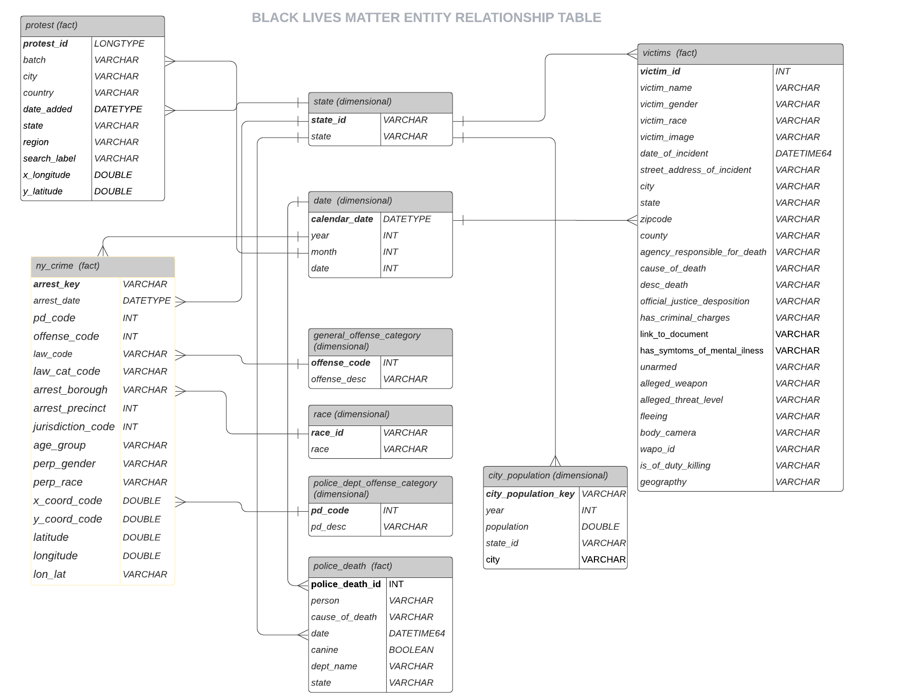

# Black Lives Matter Data Analysis 
#### Data Engineering Capstone Project
#### Project Summary
***
The purpose of this project is to understand the situation of police-related violence in the United States by mapping up raw data sources from multiple channels. Based on the raw data that I gathered from different sources, I will build data pipelines and transform data so that all the raw data can be used for further analysis. 

Ultimately, I want to gather all the crimes statistics in different cities in the US in s3 buckets, so that the data can be further analysed in conjuction with police-related violence dataset, police-death records, racial information, population of cities and location of BLM protests. This is going to be an on-going open-ended project and I will start with New York, then expand to more major cities. 

The dataset consists these types of data:
- Police shootings
- Police officer deaths suffered in the line of duty
- City population
- Locations for all BLM protests since May 25, 2020
- Crimes statistics in New York-Newark-Jersey City, NY-NJ-PA

### High Level Architectural Diagram 
***
**Choice of storage**: `AWS S3` buckets due to economical reasons and the ease of use. I can also use `Redshift Spectrum` to read data directly from S3 buckets in the future.
**Choice of programming language**: `Python and PySpark`. The crimes statistics dataset consists of million rows of data and spark is a great candidate to handle big data. 

**Future plans**:
1. Data update: The datasets used for this project mainly come from governmental websites. And the statistical datasets tend to get updated once a year. Moving forward, the data needs to be updated on a yearly basis.
2. Scalibility: I will include more crimes statistics for didfferent cities moving forward, and those datasets contain million rows of data. I will need to partition the data into tinier chucks so it doesn't take up a lot of memories. 
3. Orchestration: Airflow will be used for scheduling purposes 
4. Concurrency: I will consider using NoSql databases such as Cassandra to handle this type of issues. 

### Entity-Relationship Diagram 
***
In order to build a relational tables to map up all datasets from different sources, I decided to extract some universal data as dimensional data from NY crimes statistics dataset. 
Step 1: Build the NY crimes statistics table by dropping some columns in the original raw dataset
Step 2: Build the dim `date table` by extracting the date from NY crimes statistics data 
Step 3: Build dim `general offense category` table by extracting the offense id and offense description from NY crimes statistics table
Step 4: Build dim `police_dept_offense` table by extracting the police_dept id and police_dept offense description from NY crimes statistics table 
Step 5: Build dim `race` table by extracting the racial information of perpetrator from NY crimes statistics table 

### File Explanations 
***
- `Capstone Project.ipynb` This file is responsible for exploration, assessment and cleaning of dataset. 
- `etl.py` This python file runs an etl job to transform datasets 
- `test_etl.py` This script performs tests the quality of data 
- `dl.cfg` AWS login details

### Data Dictionary
***
##### Fact tables
1. **NY crimes statistics**
    | Column      | Description |
    | ----------- | ----------- |
    | arrest_key      | Randomly generated persistent ID for each arrest|
    | arrest_date   | Exact date of arrest for the reported event |
    | pd_code  | Three digit internal classification code (more granular than offense code)  |
    | offense_code  | Three digit internal classification code (more general category than PD code) |
    | law_code   | Law code charges corresponding to the NYS Penal Law, VTL and other various local laws        |
    | law_cat_code   | Level of offense: felony, misdemeanor, violation        |
    | arrest_borough   | Borough of arrest. B(Bronx), S(Staten Island), K(Brooklyn), M(Manhattan), Q(Queens)        |
    | arrest_precinct   | Precinct where the arrest occurred        |
    | jurisdiction_code   | Jurisdiction responsible for arrest. Jurisdiction codes 0(Patrol), 1(Transit) and 2(Housing) represent NYPD whilst codes 3 and more represent non NYPD jurisdictions        |
    | age_group   | Perpetrator’s age within a category        |
    | perp_gender   | Perpetrator’s sex description        |
    | perp_race   | Perpetrator’s race description        |
    | x_coord_code   | Midblock X-coordinate for New York State Plane Coordinate System, Long Island Zone, NAD 83, units feet (FIPS 3104)        |
    | y_coord_code   | Midblock Y-coordinate for New York State Plane Coordinate System, Long Island Zone, NAD 83, units feet (FIPS 3104)        |
    | latitude   | 	Latitude coordinate for Global Coordinate System, WGS 1984, decimal degrees (EPSG 4326)        |
    | longitude   | Longitude coordinate for Global Coordinate System, WGS 1984, decimal degrees (EPSG 4326)        |
    | lon_lat   | Georeferenced Point Column based on Longitude and Latitude fields        |

2. **Victims**
    This datasets comes from *Mapping Police Violence* (https://mappingpoliceviolence.org/aboutthedata)
    Definitions of **victims** in this dataset: 
    >Police Killing - A case where a person dies as a result of being shot, beaten, restrained, intentionally hit by a police vehicle, pepper sprayed, tasered, or otherwise harmed by police officers, whether on-duty or off-duty.

    | Column      | Description |
    | ----------- | ----------- |
    | victim_id   | Primary key for each victim        |
    | victim_name   | Name of victim        |
    | victim_gender   | Gender of victim        |
    | victim_race   | Race of victim        |
    | victim_image   | URL image of victim        |
    | date_of_incident   | Date of occurence        |
    | street_address_of_incident   | Address of occurence        |
    | city   | City of occurence        |
    | state   | State of occurence        |
    | zipcode   | Zipcode of occurence        |
    | county   | County of occurence        |
    | agency_responsible_for_death   | Police department responsible for victim's death        |
    | cause_of_death   | Reason for victim's death    |
    | desc_death   |A brief description of the circumstances surrounding the death    |
    | official_justice_desposition   |Official disposition of death (justified or other)  |
    | has_criminal_charges   | If victim had any known criminal charges        |
    | link_to_document   | Link to news article or photo of official document  |
    | has_symtoms_of_mental_ilness   | If victim had symptoms of mental illness       |
    | unarmed   | If victim was armed        |
    | alleged_weapon   | The alleged weapon victim was carrying        |
    | alleged_threat_level   | The alleged threat level victim was imposing on police       |
    | fleeing   | If victim was fleeing        |
    | body_camera   | If the police carried a body camera        |
    | wapo_id   | WaPo ID (If included in WaPo database)        |
    | is_of_duty_killing   | If it is off-duty killing        |
    | geograpthy   | Suburban/ urban or other         |

3. **Police Death**
    | Column      | Description |
    | ----------- | ----------- |
    | police_death_id   | Primary key for each record        |
    | person   | Name of police        |
    | cause_of_death   | Reason for death     |
    | date   | Date of occurence|
    | canine   | If a police dog accompanied the police officer    |
    | dept_name   | Name of police department  |   
    | State   | State of occurence |       

4. **Protest**
    | Column      | Description |
    | ----------- | ----------- |
    | protest_id   | Primary key for each record        |
    | batch   | Name of batch file (upload id)        |
    | city   | City when protest was held  |
    | country   | Country when protest was held|
    | date_added   | Date when record is uploaded to dataset  |
    | state   | State when protest was held |   
    | region   | Name of state when protest was held|      
    | search_label   | Detail address of the protest | 
    | x_longitude   | Longitude coordinate for Global Coordinate System | 
    | y_latitude   | Latitude coordinate for Global Coordinate System| 

##### Dimension Tables
5. **State**
    | Column      | Description |
    | ----------- | ----------- |
    | state_id   | State abbreviation of each US state   |
    | state   | Name of state|

6. **Date**
    | Column      | Description |
    | ----------- | ----------- |
    | calendar_date   | date in YYYY-MM-DD format   |
    | year   | year YYYY |
    | month   | month MM |
    | date   | date DD|

7. **General Offense Category**
    | Column      | Description |
    | ----------- | ----------- |
    | offense_code   | Three digit internal classification code  for offense  |
    | offense_desc   | Description of internal classification corresponding with offense code |

8. **Police Dept Offense Category**
    | Column      | Description |
    | ----------- | ----------- |
    | pd_code   | Three digit internal classification code (more granular than Offense Code) |
    | pd_desc   | Description of internal classification corresponding with PD code (more granular than Offense Description)|

9. **Race**
    | Column      | Description |
    | ----------- | ----------- |
    | race_id   |  Primary key for each record  |
    | race   | Description of race |

10. **City population**
    | Column      | Description |
    | ----------- | ----------- |
    | city_population_key   | Primary key for each record   |
    | year   | year of record |
    | population   | population of city|
    | state_id |  state of city|
    | city   | city of record |

### References to data sources:
***
The dataset was originally found in Kaggle (https://www.kaggle.com/jpmiller/police-violence-in-the-us)
1. **NY Crimes Statistics** Source: NYC OpenData https://data.cityofnewyork.us/Public-Safety/NYPD-Arrests-Data-Historic-/8h9b-rp9u
2. **Protest** Source: https://www.kaggle.com/jpmiller/police-violence-in-the-us
3. **City Population** Source: Lincoln Institute of Land Policy, https://www.lincolninst.edu/research-data/data-toolkits/fiscally-standardized-cities
4. **Victims** Source: Mapping Police Violence, https://mappingpoliceviolence.org/aboutthedata
5. **Police Death** Source: FiveThirtyEight, https://github.com/fivethirtyeight/data/tree/master/police-deaths